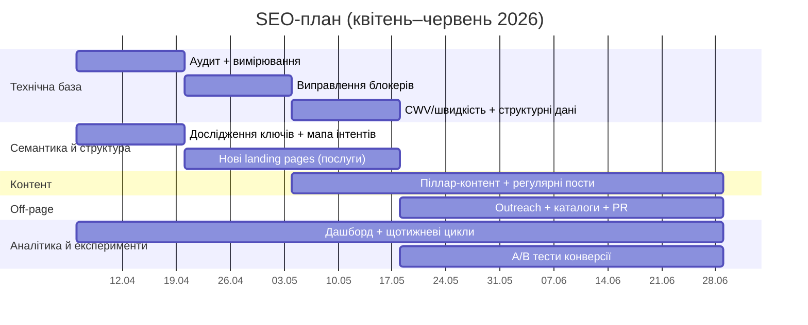

# Тримісячний покроковий SEO-план просування сайту розробника

## Резюме для керівництва

Ваш сайт уже має сильні “комерційні” активи: чіткі послуги (створення з нуля, редизайн, лендінг під рекламу, AI‑інтеграції), портфоліо з детальними кейсами та блог із актуальними матеріалами українською мовою. citeturn1view0turn4view0turn4view2turn5view0  
Завдання SEO на найближчі 3 місяці — перетворити ці активи на системний “попит → сторінка → лід” через технічну стабільність (індексація, швидкість, JS‑рендеринг), правильну семантику (інтент‑мапа), регулярний контент‑випуск і безпечний лінкбілдинг (без ризику санкцій). citeturn25search0turn16search0turn11search2turn12search1

У кінці 3‑го місяця ви маєте вийти на стан, коли:
- усі ключові URL коректно індексуються й не мають критичних технічних блокерів (Page Indexing, URL Inspection, Sitemaps у Google Search Console); citeturn23search1turn23search0turn10search14turn10search8
- Core Web Vitals у “Good” для основних шаблонів сторінок (LCP/INP/CLS) і контролюються як у звітах Search Console, так і через PageSpeed Insights; citeturn0search5turn0search6turn0search3
- з’являється “кластерна” структура: ключові послуги винесені в окремі посадкові сторінки + контент‑хаби (піллар‑статті) + регулярні supporting‑пости; це дасть внутрішню перелінковку, яка допомагає пошуку знаходити/розуміти сторінки та розподіляти релевантність. citeturn25search6turn25search2turn16search3
- налаштовано KPI‑панель (поєднання даних Search Console + Google Analytics через Looker Studio) і є цикл щотижневих/щомісячних SEO‑ритуалів. citeturn17search10turn18search8turn17search7

Нижче — повний аудит‑чекліст, методологія семантики, контент‑календар на 3 місяці, шаблони on‑page і outreach, план внутрішніх та зовнішніх посилань, пріоритизація технічних правок у вигляді спринтів, KPI та трекінг, ідеї A/B‑тестів, а також copy‑ready задачі для таск‑менеджера.

## Контекст, цілі та рамки плану

Сайт позиціонує вас як розробника, який робить бізнес‑сайти на сучасному стеку й підсилює їх AI‑інтеграціями; ключові тематичні “опори” вже є в текстах головної та кейсах/блозі. citeturn1view0turn5view0turn6view2turn4view2  
Окремо важливо, що ви самі пишете українською, і це конкурентна перевага для запитів українською/російською в Україні (а за потреби — можна додати англомовну версію як другий ринок; див. технічні вимоги до мультимовності нижче). citeturn16search3turn15search2

### Бізнес‑цілі на 3 місяці

Основна бізнес‑ціль: збільшити кількість якісних звернень (лідів) із органічного пошуку. Для цього SEO‑цілі формулюємо так, щоб їх можна було вимірювати:
- Зростання органічних кліків/показів і CTR по пріоритетним сторінкам/кластерам у Search Console (Performance report). citeturn18search8turn18search2
- Зростання частки сторінок у “Good” по Core Web Vitals для ключових шаблонів і стабільний “pass” в оцінці CWV на 75‑му перцентилі (PSI). citeturn0search6turn0search3turn16search0
- Нуль “критичних” причин неіндексації важливих URL у Page Indexing + контроль індексації нових матеріалів через URL Inspection (із розумінням, що індексація може тривати до 1–2 тижнів). citeturn23search1turn23search0
- Конверсії/ключові події в аналітиці: відправка форми, клік по контакту/месенджеру, запит на консультацію тощо — керуються через GA4 events/“key events”. citeturn17search7turn17search4

### Плановий горизонт і календар

План розрахований на 12 тижнів від поточної дати **6 квітня 2026** (Європа/Київ) до кінця червня 2026 включно. Для execution‑логіки використовуємо 6 двотижневих спринтів.



## Технічний SEO-аудит і чекліст

Технічний аудит тут — це не “разова перевірка”, а процес: налаштувати вимірювання → знайти блокери → виправити → підтвердити в Search Console → закріпити моніторинг. citeturn23search12turn23search1turn23search3

### Базові інструменти та джерела істини

- **Google Search Console** як основне джерело про індексацію, CWV‑звіт і пошукову продуктивність (кліки, покази, CTR, позиція). citeturn23search12turn18search8turn0search5  
- **URL Inspection** для перевірки конкретних URL і запиту (ре)індексації з квотою та реалістичним часом очікування. citeturn23search0turn23search3  
- **PageSpeed Insights** для Core Web Vitals (INP/LCP/CLS) і проходження оцінки на 75‑му перцентилі. citeturn0search6turn0search3  
- **Screaming Frog** для повзання сайту й виявлення 404/редіректів/метаданих/директив/дублів (як практичний технічний краулер). citeturn18search3turn18search0  
- **Ahrefs/SEMrush** — для семантики, конкурентних ключів, посилального профілю й контент‑gap аналізу. citeturn18search4turn18search11  

Додатково (опційно): Google Trends для сезонності та підбору тем/формулювань, Keyword Planner для об’єму/прогнозів. citeturn22search0turn22search4

### Чекліст технічного аудиту з тестами, інструментами й порогами

| Зона | Що тестувати (як саме) | Інструмент/звіт | Очікуваний поріг (практичний стандарт) | Примітка/вихід |
|---|---|---|---|---|
| Індексація | Чи немає критичних причин “Not indexed” для важливих URL (головна/послуги/кейси/блог) | Page indexing report | Важливі URL = Indexed; “Not indexed” лише для службових/дублів | Причини дивитися по таблиці “Why pages aren’t indexed”. citeturn23search1 |
| Індексація нових сторінок | Після публікації — перевірити “Live test”/індексацію, за потреби “Request indexing” | URL Inspection tool | Запит індексації зроблено; очікування до 1–2 тижнів — норма | Не “спамити” повторними запитами. citeturn23search0turn23search3 |
| Sitemap | Наявність sitemap, коректність форматів, тільки канонічні URL, оновлення після публікацій | Sitemaps report + гайд Build/submit sitemap | Sitemap успішно прочитаний; без parsing errors | Додавати sitemap у robots.txt або сабмітити в GSC. citeturn10search8turn10search14 |
| Robots | Чи не закриті важливі розділи від краулінгу; чи robots.txt не використовується як noindex | robots.txt правила + robots meta tag | robots.txt не блокує потрібні URL; noindex керується meta/X-Robots-Tag | robots.txt не є механізмом приховання сторінки з пошуку. citeturn10search0turn10search7 |
| Robots.txt розмір | Ліміт файлу | robots.txt spec | < 500 KiB | Надлишок ігнорується після ліміту. citeturn10search3 |
| Канонікали/дублі | Канонічні URL узгоджені між sitemap, rel=canonical, внутрішніми посиланнями; немає “Google chose different canonical…” через конфлікти | Canonicalization docs + (практично) Screaming Frog | 1 канонічний URL на 1 сутність; немає конфліктуючих сигналів | Не використовувати robots.txt для канонізації; і не змішувати суперечливі сигнали. citeturn15search1turn15search13 |
| Статуси URL | 200 для індексованих; 301/308 для постійних редіректів; немає soft‑404 | (практично) Screaming Frog + перевірки | 0 internal 4xx/5xx; 0 soft‑404 | Soft‑404 — коли “не знайдено”, але код 200. citeturn15search0 |
| Mobile-first | Контент/метадані/структурні дані на мобільній версії еквівалентні; немає “фрагмент‑URL як сторінки” | Mobile-first indexing best practices | Повна контент‑паритетність | Google індексує мобільну версію як основу. citeturn15search2 |
| JS‑рендеринг | Чи контент доступний для індексації (SSR/SSG/пререндер) і не зникає без JS; чи немає залежності від dynamic rendering | JavaScript SEO basics + dynamic rendering note | Критичний контент видно у “view as Google” (URL Inspection) | Dynamic rendering — workaround, не рекомендована довгострокова стратегія. citeturn25search0turn25search1 |
| Внутрішні посилання | Всі важливі сторінки доступні через crawlable `<a href>`; нормальний анкор-текст | Link best practices + link architecture | 0 “сирітських” сторінок; ключові сторінки за ≤3 кліки від головної | Внутрішня архітектура критична для знаходження/індексації. citeturn25search2turn25search6 |
| URL‑структура | Людяні, описові URL мовою аудиторії; послідовна ієрархія | URL structure best practices | URL описує сутність сторінки; стабільність (без частих змін) | Рекомендація робити URL зрозумілими людям. citeturn16search3 |
| HTTPS | Увесь сайт на HTTPS без змішаного контенту | HTTPS ranking signal | 100% HTTPS | HTTPS — ранжувальний сигнал (хай і легкий). citeturn16search2 |
| Core Web Vitals | LCP/INP/CLS по основних шаблонах | CWV report + PSI | Good: LCP ≤2.5s; INP ≤200ms; CLS ≤0.1 | CWV використовуються ранжувальними системами; PSI опирається на 75‑й перцентиль. citeturn0search3turn0search6turn16search0 |
| Структурні дані | Валідність JSON‑LD; відповідність контенту; не приховано; не заблоковано robots/noindex | SD guidelines + Rich Results Test | 0 критичних помилок; поля релевантні й правдиві | JSON‑LD рекомендовано; Structured data ≠ гарантія rich‑результату. citeturn14search0turn19search15 |
| Тайтли/сніпети | Чіткий головний заголовок; адекватні title links; релевантні meta descriptions | Title links + Snippet docs | Title унікальний; відповідає сторінці; description “продає” клік | Google може використовувати різні джерела для title/snippet. citeturn10search1turn10search2 |

### Пріоритизація технічних правок

Пріоритизацію робимо за принципом: **блокери індексації → критичні UX/швидкість → масштабованість контенту → косметика**. Це напряму узгоджується з тим, що пошук спершу має “знайти й прочитати”, а вже потім — “оцінити й показати”. citeturn25search19turn23search1

Ключові швидкі перемоги (зазвичай дають найкращий ROI для персонального сайту розробника):
- “Розпакувати” one‑page логіку у **окремі посадкові сторінки послуг** з унікальними URL (бо фрагменти `#...` — це навігація всередині сторінки, а не повноцінні сторінки для індексації як окремі сутності). citeturn16search3turn15search2  
- Налаштувати стабільний sitemap + контроль індексації нових URL через URL Inspection. citeturn10search8turn23search0  
- Довести основні шаблони до “Good” Core Web Vitals, бо CWV — частина page experience сигналів. citeturn16search0turn0search6  

## Методологія дослідження ключових слів і мапа намірів

SEO для сайту розробника найчастіше виграється не “головним” ВЧ запитом (типу “розробка сайтів”), а **комбінацією**: локальні модифікатори + технологія + тип бізнесу/галузь + біль/задача. Це добре узгоджується з тим, як пошук визначає релевантність: значення запиту, відповідність і корисність. citeturn16search8

### Побудова seed‑списку

Seed keywords — це стартові фрази, від яких інструменти генерують тисячі ідей; у Ahrefs вони прямо описані як вихідна точка й часто знаходяться також через конкурентів. citeturn18search7turn18search1  

**Рекомендований seed‑набір (для вашого позиціонування):**
- “розробка сайтів”, “створення сайту”, “сайт під ключ”, “лендінг”, “бізнес‑сайт”, “інтернет‑магазин”
- “Next.js розробка”, “React розробка”, “сайт на Next.js”, “оптимізація швидкості сайту”, “SSR для SEO”
- “AI чат‑бот для сайту”, “AI інтеграції”, “LLM інтеграція”, “автоматизація заявок”
- локальні: “Київ”, “Київська область”, “Україна”, “віддалено”
- галузеві: “для юристів”, “для ресторану”, “для освіти”, “для B2B”, “для виробництва” (узгоджується з вашими кейсами) citeturn6view2turn6view1turn5view1

### Інструменти й процес збору семантики

1) **Google Search Console → Performance report**: зібрати реальні запити, за якими сайт уже має покази/кліки, та відфільтрувати “низький CTR при високих показах” (кандидати на переписування title/description). Метрики кліків/показів/CTR/позиції — визначені в документації. citeturn18search8turn18search2  

2) **Google Trends**: перевірити сезонність і “правильні формулювання” (наприклад, “розробка сайту” vs “створення сайту”, “лендінг” vs “landing page”), щоб писати мовою аудиторії. citeturn22search0turn22search8  

3) **Keyword Planner**: отримати орієнтовний обсяг і прогнози по базовим кластерам (особливо корисно для локального ринку). citeturn22search4turn22search6  

4) **Ahrefs/SEMrush**:  
- генерація списків за seed (volume/keyword difficulty/intent — залежно від інструмента); citeturn18search11turn18search15  
- **competitor keywords** і content gap: конкурентні ключі — це запити, по яких ранжуються конкуренти, і це один із найшвидших способів розширити семантику. citeturn18search4turn18search14  

5) **SERP‑аналіз конкурентів вручну** (мінімальний): зібрати 10–20 доменів, які стабільно в топі по “розробка сайтів Київ”, “розробка сайту на Next.js” тощо — і подивитись, які сторінки ранжуються (послуга/портфоліо/стаття), який формат контенту домінує. Як стартові приклади конкурентних сторінок для “Next.js розробка” і “розробка сайтів Київ” можна взяти локальні агенції/студії, що прямо комунікують ці послуги. citeturn21search13turn21search4turn21search6  

### Мапування пошукових намірів

Щоб контент працював, кожен кластер ключів прив’язується до **інтенту**, і вже від інтенту вибирається формат сторінки.

| Інтент | Приклади запитів (типові) | Найкращий тип сторінки | CTA/конверсія | Як вимірювати |
|---|---|---|---|---|
| Комерційний (service) | “розробка сайту на Next.js”, “лендінг під рекламу” | Landing page послуги | “Запросити оцінку”/форма/месенджер | GA4 key event + GSC page CTR |
| Локальний | “розробка сайтів Київ”, “веб‑розробник Київ” | Landing “місто/регіон” + Business profile | Дзвінок/месенджер/форма | GA4 + локальні покази |
| Інформаційний | “скільки коштує сайт”, “як обрати розробника” | Гайд/піллар‑стаття | lead magnet / консультація | GSC (queries) + scroll |
| Порівняльний | “React vs Tilda”, “WordPress чи Next.js” | Порівняння/таблиця/кейси | консультація з вибору | CTR/engagement |
| Технічний (dev) | “Next.js SEO”, “Core Web Vitals Next.js” | Туторіал/чекліст | підписка/контакт | органіка + посилання |

Ваш блог уже частково покриває інформаційний і порівняльний інтент (вибір розробника, ціна, React vs Tilda). citeturn4view0turn4view1turn4view2  
Це означає, що наступний крок — добудувати **комерційні сторінки послуг** і “зв’язати” їх із блогом та кейсами внутрішніми посиланнями. citeturn25search6turn25search2

## Контент-стратегія, редакційний календар і on-page шаблони

### Стратегія контенту на 3 місяці

Контент‑машина для сайту розробника має 4 типи сторінок (усі ви просили включити):
- Landing pages (послуги/ніші/міста) — закривають транзакційні/комерційні запити.
- Case studies — “доказ результату” + природні брендові/нішеві запити.
- Tutorials/гайди — захоплення попиту, якого ви не купуєте рекламою (особливо якщо працюєте як фриланс/соло).
- Блог‑пости (гайди/порівняння/devlog) — нарощують topical authority і дають внутрішні точки входу.

Сильний момент: кейси на сайті вже детально описані (проблема → рішення → стек/архітектура → результат), що ідеально лягає в “case‑study як лінк‑магніт”. citeturn5view0turn6view2turn6view1

Рекомендована частота (реалістична для одного автора):
- 1 глибокий матеріал / тиждень (гайд або туторіал або кейс‑апдейт)
- + 1 легший матеріал / тиждень (short‑guide, чекліст, “помилки”, невеликий devlog)

Це дає **8–10 публікацій/місяць** з урахуванням того, що частина — оновлення існуючих сторінок (що теж важливо для SEO).

### Редакційний календар на квітень–червень 2026

> Примітка: назви/ключі — робочі. Перед публікацією фіналізуйте семантику через GSC + Ahrefs/SEMrush + SERP‑аналіз.

| Тиждень | Дата (старт) | Тип | Робоча тема | Цільовий інтент | Primary keyword (кластер) | Внутрішні лінки (мінімум) | CTA |
|---|---:|---|---|---|---|---|---|
| W1 | 06.04 | Landing page | “Розробка сайтів на Next.js для бізнесу” | Комерційний | next.js розробка сайту | → кейси (2), → прайс/контакт, → 2 блог‑пости | “Оцінити проєкт” |
| W1 | 06.04 | Туторіал | “Next.js SEO чекліст: SSR/SSG, мета‑теги, sitemap” | Інфо/тех | next.js seo | → Landing Next.js, → 1 кейс | “Запитати по SEO” |
| W2 | 13.04 | Landing page | “Лендінг під рекламу: швидкість, аналітика, A/B” | Комерційний | лендінг під рекламу | → кейс (де є A/B/аналітика), → блог “ціна” | “Запустити за 7 днів” |
| W2 | 13.04 | Блог | “Сайт на конструкторі vs кастом: коли бізнес переплачує” | Порівняльний | tilda vs next.js / конструктор vs розробка | → Landing Next.js, → “React vs Tilda” | “Підібрати варіант” |
| W3 | 20.04 | Landing page | “AI‑інтеграції для сайту: чат‑бот, форми, CRM, Telegram” | Комерційний | ai чат-бот для сайту | → кейс AGENTIS, → кейс e‑commerce | “Зробити MVP” |
| W3 | 20.04 | Кейс‑апдейт | “AGENTIS: що було зроблено для SEO/індексації” | Доказ/інфо | legal tech платформа seo | → Landing AI, → блог про вибір розробника | “Хочу схоже” |
| W4 | 27.04 | Блог‑гайд | “Як обрати підрядника: чекліст для бізнесу (оновлення + FAQ)” | Інфо | як обрати розробника сайту | → послуги, → контакти | “Консультація” |
| W4 | 27.04 | Туторіал | “Core Web Vitals: LCP/INP/CLS — як міряти й фіксити” | Інфо/тех | core web vitals | → Landing “лендінг”, → Next.js SEO | “Аудит швидкості” |
| W5 | 04.05 | Landing (нішевий) | “Сайт для юридичної компанії / Legal Tech” | Комерційний/нішевий | сайт для юристів | → кейс AGENTIS, → блог “ціна” | “Порахувати бюджет” |
| W5 | 04.05 | Кейс | “Atlas: SEO як єдиний канал — архітектура, індексація” | Доказ | seo для інтернет-магазину | → Landing e‑commerce, → tutorial CWV | “Запустити магазин” |
| W6 | 11.05 | Блог | “Скільки коштує сайт: калькулятор/формула (оновлення)” | Інфо → комерц | скільки коштує сайт | → прайс, → всі послуги | “Отримати оцінку” |
| W6 | 11.05 | Туторіал | “Structured data для сервіс‑сайту: Person/ProfessionalService/Breadcrumb” | Інфо/тех | schema.org для сайту | → кожна landing page | “Поставити розмітку” |
| W7 | 18.05 | Блог | “Редизайн без втрати SEO: канонікали, редіректи, sitemap” | Інфо/комерц | редизайн сайту seo | → Landing “редизайн”, → кейс ACE | “План міграції” |
| W7 | 18.05 | Landing | “Редизайн і перезапуск” | Комерційний | редизайн сайту київ/україна | → 2 кейси, → блог міграції | “Аудит сайту” |
| W8 | 25.05 | Кейс | “ACE: контент‑структура, Schema, швидкість — що дало ефект” | Доказ | освітня платформа next.js | → Landing Next.js, → blog CWV | “Хочу платформу” |
| W8 | 25.05 | Туторіал | “Внутрішня перелінковка: як побудувати кластер” | Інфо | внутрішня перелінковка | → всі landing pages | “Підказати структуру” |
| W9 | 01.06 | Блог | “Веб‑аналітика для бізнесу: які метрики реально потрібні” | Інфо | ga4 для сайту | → Landing “лендінг”, → контакти | “Налаштувати аналітику” |
| W9 | 01.06 | Landing (локальний) | “Розробка сайтів: Київ/Київська область (service area)” | Локальний | розробка сайтів київ | → послуги, → кейси, → про мене | “Зателефонувати/написати” |
| W10 | 08.06 | Туторіал | “Валідація індексації: URL Inspection + Page indexing” | Інфо/тех | google search console індексація | → helpful links | “Перевірити сайт” |
| W10 | 08.06 | Блог | “Технічне ТЗ на сайт: шаблон для підприємця” | Інфо | тз на розробку сайту | → “вибір розробника”, → послуги | “Отримати шаблон” |
| W11 | 15.06 | Кейс/сторінка | “Портфоліо‑хаб: кейси за індустріями” | Комерційний | приклади сайтів next.js | → всі кейси | “Обрати напрям” |
| W11 | 15.06 | Блог | “Чому швидкість впливає на SEO і конверсію: розбір” | Інфо | pagespeed seo | → CWV tutorial | “Аудит” |
| W12 | 22.06 | Піллар‑гайд | “Повний гайд: як замовити сайт і не згоріти” | Інфо → комерц | замовити сайт під ключ | → усі послуги | “Консультація” |
| W12 | 22.06 | Оновлення | “Оновити всі landing pages: FAQ‑блок, анкор‑лінки, CTA” | Комерц | — | → взаємна перелінковка | “Оцінка” |

Цей календар навмисно “чіпляється” за те, що у вас уже добре працює: практичні гайди (вибір розробника/ціни) і сильні кейси. citeturn4view0turn4view2turn5view0turn6view2

### On-page шаблони та copy-ready заготовки

#### Шаблон Title (title link) та H1

Google пояснює, що title link у видачі формується з різних джерел (включаючи `<title>` і заголовки), тому важливо мати один “головний” чіткий заголовок і несуперечливий тайтл. citeturn10search1

**Формула для landing page послуги (UA):**  
- Title: `{Послуга} для {сегмент/ніша} — {вигода} | {Бренд/Ім’я}`  
- H1: `{Послуга}, яка дає {результат}`  

**Приклад:**  
- Title: `Розробка сайту на Next.js для бізнесу — швидко, SEO-ready | Олександр Кравченко`  
- H1: `Розробка сайту на Next.js, який приносить ліди`

#### Шаблон Meta description

Google прямо пише: meta description — це короткий релевантний “пітч”, який може бути використаний для сніпета. citeturn10search2turn10search6

**Формула:**  
`{Хто ви + що робите}. {Для кого}. {Сильні відмінності/доказ}. {CTA}.`  

**Приклад (landing Next.js):**  
`Розробляю швидкі бізнес‑сайти на Next.js з SEO та аналітикою. Лендінги, магазини, платформи. Портфоліо з кейсами й цифрами. Отримайте оцінку за 24 години.`

#### Шаблон структури H2–H3 для landing page

- H2: Проблема/сценарій клієнта (1–2 абзаци)
- H2: Рішення (що саме робите)
- H2: Процес (кроки)
- H2: Результати/кейси (2–4 карточки з лінками)
- H2: Вартість/пакети (або “як формується ціна”)
- H2: FAQ (контент для людей; rich‑результати не гарантуються)

Важливо: FAQ rich results сильно обмежені — Google офіційно зазначив, що FAQ‑rich буде показаний лише для добре відомих авторитетних урядових і медичних сайтів, а для інших — “не регулярно”. Тому FAQ‑блок робимо насамперед для конверсії/довіри, а не “для зірочок у SERP”. citeturn20view0  

#### Schema snippets (рекомендовані заготовки)

Google рекомендує JSON‑LD як формат і наголошує на правдивості/видимості даних, а також на тестуванні через Rich Results Test. citeturn14search0turn19search15  
Нижче — **мінімалістичні** приклади (їх треба адаптувати та не підставляти фейкові дані).

**Article для блог‑постів (приклад):**
```json
{
  "@context": "https://schema.org",
  "@type": "Article",
  "headline": "Next.js SEO чекліст: SSR/SSG, sitemap, мета-теги",
  "author": { "@type": "Person", "name": "Олександр Кравченко" },
  "datePublished": "2026-04-10",
  "dateModified": "2026-04-10",
  "mainEntityOfPage": { "@type": "WebPage", "@id": "https://example.com/blog/nextjs-seo-checklist/" }
}
```
citeturn14search3turn14search0

**BreadcrumbList для сторінок /blog/… і /projects/… (приклад):**
```json
{
  "@context": "https://schema.org",
  "@type": "BreadcrumbList",
  "itemListElement": [
    { "@type": "ListItem", "position": 1, "name": "Головна", "item": "https://example.com/" },
    { "@type": "ListItem", "position": 2, "name": "Блог", "item": "https://example.com/blog/" },
    { "@type": "ListItem", "position": 3, "name": "Next.js SEO чекліст", "item": "https://example.com/blog/nextjs-seo-checklist/" }
  ]
}
```
citeturn14search1turn14search8

**Local Business markup** (лише якщо справді просуваєтесь як локальний сервіс):  
Google описує, що Local Business structured data допомагає передати години/підрозділи/інші атрибути й може вплинути на представлення в результатах/knowledge panel. citeturn13search2

### План внутрішньої перелінковки

Внутрішня архітектура посилань — критична для того, щоб пошуковий робот знаходив сторінки й розумів їхню роль. Це прямо підкреслює документація та матеріали про link architecture. citeturn25search6turn25search2

**Рекомендована модель: “Hub → Spoke → Proof”**
- Hub (піллар): “Розробка сайтів для бізнесу” (або “Послуги”) — як головний вузол.
- Spoke (landing pages): окремі сторінки кожної послуги/ніші.
- Proof: кейси та релевантні блог‑пости, що підсилюють spoke.

**Правила (практичні):**
- Кожна landing page має:
  - 2–3 лінки на релевантні кейси
  - 2 лінки на інфо‑пости (гайди)
  - 1 лінк “Назад до послуг/хабу”
- Кожен блог‑пост має:
  - 1–2 посилання на відповідну landing page
  - 1 посилання на кейс
  - 1 посилання на “суміжний” пост (серія)
- Анкори — описові, природні, без “клікніть тут”. Практики про crawlable links і анкор‑текст є в документації. citeturn25search2turn10search12

## Off-page просування, backlinks, PR та локальне SEO

### Політики та безпечні рамки лінкбілдингу

Google прямо описує spam policies та попереджає про маніпулятивні посилання; за “unnatural links” можливі manual actions. citeturn11search2turn12search1  
Також існують механізми кваліфікації вихідних посилань (`rel` атрибути) і концепція `nofollow`/`sponsored`/`ugc`. citeturn12search2turn12search6

Висновок для стратегії: **прагнемо earning links**, а не “покупки ваги”. Усі outreach‑активності робимо так, щоб вони виглядали як редакційна співпраця/корисний ресурс, а не як масове розміщення.

### Тактики отримання посилань (реалістичні для сайту розробника)

1) **Посилання з клієнтських проєктів**  
Найсильніша, найприродніша тактика для портфоліо: попросити клієнтів поставить “Developed by …” у футері або “Команда”/“Партнери” (краще — не у футері sitewide, а на сторінці “Про проєкт/контакти”, щоб не виглядало як шаблонний лінк‑обмін).  
Це максимально “біло”, бо ґрунтується на реальній взаємодії.

2) **Гостьові колонки (обмежено, якісно)**  
Не робимо “масову” кампанію. Обираємо 5–10 релевантних медіа/блогів/ком’юніті (IT, малого бізнесу, legal tech) і даємо унікальний матеріал: технічний розбір, цифри, чеклісти. Якщо лінк є — він має бути природним; якщо співпраця платна — маркування. citeturn12search2turn12search6turn12search1  

3) **Digital PR через “лінк‑магніти”**  
Ви вже маєте контент “Скільки коштує сайт у 2026” — це ідеальна база для PR, якщо додати:  
- прозору методологію (як рахували),  
- невеликий dataset (анонімізований) або калькулятор,  
- “інсайти ринку” (3–5 графіків).  
Такі матеріали частіше цитують та лінкують, ніж “звичайні” статті.

4) **Каталоги та профілі (контроль NAP)**  
Робимо мінімальний набір: профілі/портфоліо‑платформи, де реально можуть прийти клієнти. Ключове — узгодженість контактних даних (NAP) для локального SEO (див. наступний блок).

### Шаблони для outreach (copy-ready)

#### Лист “посилання з клієнтського сайту”

Тема: `Коротке прохання щодо [назва проєкту] — credit link`

Текст:
> Привіт, [Ім’я]!  
> Дякую ще раз за співпрацю по [проєкт].  
> Є маленьке прохання: чи можемо додати на сторінку [контакти/про проєкт] короткий credit “Розробка: [ваше ім’я]” з посиланням на мій сайт?  
> Це допоможе мені показувати портфоліо, а вам — прозоро зафіксувати підрядника.  
> Ось варіант тексту: “Розробка сайту: [Ім’я, сайт]”.  
> Дякую! Якщо зручніше — сам підготую точний HTML/текст.

#### Пітч для гостьового поста

Тема: `Ідея статті для [Медіа]: [конкретна тема + цифри]`

Текст:
> Вітаю, [Ім’я/редакція]!  
> Я [хто ви], роблю бізнес‑сайти та кейси з фокусом на швидкість/SEO/AI.  
> Пропоную матеріал для вашої аудиторії: **[назва]**.  
> Чому це буде корисно:  
> – [1–2 практичні інсайти]  
> – [чекліст/таблиця/калькулятор]  
> – [приклад з кейсу/цифри]  
> Готовий написати ексклюзивно під вас (без копіпасту), обсяг [X], дедлайн [Y].  
> Якщо цікаво — надішлю короткий план і чернетку вступу.

### Локальне SEO (якщо для вас актуальний локальний ринок)

Оскільки на сайті є акцент на регіон (Київ/область) і локальні сценарії клієнтів, є сенс зробити мінімальний локальний стек, **якщо ви реально працюєте з локальними клієнтами** (навіть якщо частина — віддалено). citeturn1view0  

1) **Business Profile**  
Google прямо позиціонує Business Profile як безкоштовний інструмент для присутності у Search/Maps. citeturn13search14  

2) **Service‑area налаштування (якщо немає офісу для прийому клієнтів)**  
Є офіційні інструкції: можна додати до 20 service areas; а адресу слід приховувати, якщо ви — service‑area business. citeturn13search1turn13search5  

3) **Local business structured data**  
Якщо локальність важлива, додайте/перевірте Local Business markup (або специфічніший підтип на кшталт ProfessionalService), але тільки з правдивими даними. citeturn13search2turn14search0  

## KPI, трекінг, спринти та регулярні задачі

### KPI‑панель і джерела даних

Search Console дає кліки/покази/CTR/позицію; це основа SEO‑звітності. citeturn18search8turn18search2  
Поєднувати дані Search Console + Analytics у Looker Studio — рекомендований шлях, який описаний у документації. citeturn17search10  
Для зв’язку Search Console ↔ Analytics потрібні права (Editor у GA4 + verified owner у Search Console). citeturn17search1

### KPI dashboard (таблиця)

| KPI | Визначення | Інструмент | Як часто дивитись | Ціль на 3 міс. (орієнтир) |
|---|---|---|---|---|
| Organic clicks | Кліки з пошуку | Search Console Performance | щотижня | стабільне зростання WoW після 4–6 тижнів |
| Impressions | Покази в пошуку | Search Console Performance | щотижня | зростання охоплення семантики |
| CTR | Clicks / Impressions | Search Console Performance | щотижня | підняти на сторінках з високими показами (через тайтли/сніпети) |
| Avg position | Середня позиція | Search Console Performance | щотижня | не як самоціль; дивитися по кластерах |
| Indexed важливі URL | Частка важливих сторінок “Indexed” | Page Indexing report | щотижня | 100% важливих сторінок |
| CWV pass rate | Good по LCP/INP/CLS на 75‑му перцентилі | PSI + CWV report | щомісяця | “Good” для основних шаблонів |
| Leads / key events | Надсилання форми, клік по контакту тощо | GA4 events / key events | щотижня | тренд зростання після посадкових сторінок |
| Landing page CVR | Leads / sessions для сторінок послуг | GA4 | щотижня | підняти через A/B тести |
| Backlinks (якість) | Нові домени/посилання (релевантні) | Ahrefs/SEMrush | щомісяця | +5–15 якісних згадок/лінків |

Тлумачення метрик Search Console (імпресії/позиції/кліки) має нюанси і описане офіційно; важливо читати ці визначення правильно, щоб не робити хибних висновків. citeturn18search2turn18search8

### Спринт‑план технічних і контентних робіт

| Спринт | Дати | Результат спринту | Технічні задачі | Контент/SEO задачі | Off-page |
|---|---|---|---|---|---|
| Sprint A | 06.04–19.04 | База вимірювань + список блокерів | GSC налаштування, індексація, sitemap/robots перевірки, первинний crawl | Семантика seed + intent map; бриф на 2 landing pages | Скласти список партнерів/клієнтів для credit links |
| Sprint B | 20.04–03.05 | Перші landing pages + виправлені блокери | Канонікали/редіректи/soft‑404, crawlable links | Публікація 2 landing + 2 постів; базова внутрішня перелінковка | 5 outreach листів клієнтам |
| Sprint C | 04.05–17.05 | CWV оптимізація основних шаблонів | PSI аудит, LCP/INP/CLS правки | 2 пости + 1 кейс‑апдейт; schema для блогу/хлібних крихт | 3 PR‑пітчі (гайд/калькулятор/дослідження) |
| Sprint D | 18.05–31.05 | Структура кластерів готова | JS SEO перевірки, mobile parity | 1 landing + 2 матеріали; перелінковка “hub‑spoke‑proof” | 3 гостьові пітчі |
| Sprint E | 01.06–14.06 | Локальний контур (за потреби) | Local business markup, профіль/контакти | 1 локальний landing + 2 матеріали | каталоги/профілі (мінімальний whitelist) |
| Sprint F | 15.06–28.06 | Оптимізація під конверсію | моніторинг, дрібні технічні правки | піллар‑гайд + оновлення існуючих сторінок | друга хвиля outreach + партнерства |

### Щотижневі та щомісячні задачі

**Щотижня (30–60 хв):**
- Перевірити Search Console: Performance (топ‑сторінки/запити), Page Indexing (нові причини), CWV (якщо є дані). citeturn18search8turn23search1turn0search5  
- Обрати 2 сторінки з високими показами і низьким CTR → переписати title/description. citeturn10search1turn10search2  
- Перевірити 1–2 нові URL через URL Inspection після публікацій; за потреби request indexing. citeturn23search0turn23search3  
- Додати внутрішні лінки з нових постів на відповідні landing pages (мінімум 2). citeturn25search2turn25search6  

**Щомісяця (2–3 год):**
- Повний PSI аудит ключових шаблонів + backlog для LCP/INP/CLS. citeturn0search6turn0search3  
- Перевірка структурних даних через Rich Results Test і виправлення критичних помилок. citeturn19search15turn14search0  
- Лінк‑рев’ю: чи не з’явилися токсичні патерни (і чи немає ризику manual action). citeturn12search1turn11search2  

### A/B testing: гіпотези й як вимірювати

GA4 визначає A/B test як рандомізований експеримент з 2+ варіантами сторінки, які показуються випадковим користувачам одночасно. citeturn11search14  
GA дозволяє інтегрувати сторонній A/B інструмент і інтерпретувати результати в Analytics. citeturn11search1  

**Перші 6 A/B‑гіпотез (для підняття лідів):**
1) Hero‑headline: “Роблю сайти, які працюють…” vs “Сайт за 2–4 тижні з SEO та аналітикою” → метрика: lead rate.  
2) CTA: “Оцінити проєкт безкоштовно” vs “Отримати кошторис за 24 години” → CTR CTA + lead.  
3) Прайс‑блок: 3 пакети vs “від/до + що входить” → lead quality (якщо є qualification).  
4) Контакт‑форма: коротка (ім’я+контакт+1 питання) vs довша (тип проєкту/бюджет/строк) → lead rate vs якість.  
5) Соціальний доказ: відгуки вище vs нижче → scroll depth + conversions.  
6) Кейс‑подача: “технічний стек” першим vs “бізнес‑ефект” першим → clicks to case + leads.

**Правило інтерпретації:** запускати тест лише з однією зміною за раз, і фіксувати мінімальну тривалість (зазвичай 2–3 тижні) щоб згладити тижневу сезонність.

## Copy-ready задачі для таск-менеджера

Нижче — короткі, вставні задачі (1 задача = 1 дія). Формат підходить для Notion/Asana/ClickUp/Trello.

### Sprint A

- [ ] Підтвердити доступи: Google Search Console (власник) і GA4 (Editor)  
- [ ] Зв’язати Search Console ↔ Analytics (якщо ще не зв’язано) citeturn17search1turn17search10  
- [ ] Зняти baseline: Export Performance (останні 28 днів) — топ‑запити/сторінки  
- [ ] Перевірити Page Indexing: виписати всі причини Not indexed для важливих URL citeturn23search1  
- [ ] Налаштувати первинний crawl у Screaming Frog (200/301/404, titles, meta, directives) citeturn18search3turn18search0  
- [ ] Зібрати seed keywords (5 груп) + узгодити intent map (таблиця) citeturn18search7turn22search0  

### Sprint B

- [ ] Створити landing page “Next.js для бізнесу” (унікальний URL + H1 + CTA) citeturn16search3turn10search1  
- [ ] Створити landing page “Лендінг під рекламу”  
- [ ] Додати 5 внутрішніх лінків з блогу/кейсів на кожну landing page citeturn25search2turn25search6  
- [ ] Перевірити канонікали (1 URL = 1 canonical; без конфліктів) citeturn15search1turn15search13  
- [ ] Перевірити soft‑404/404 (виправити або 301) citeturn15search0  

### Sprint C

- [ ] Прогнати PSI по головній + шаблону блогу + шаблону кейсу; виписати LCP/INP/CLS backlog citeturn0search6turn0search3  
- [ ] Додати/перевірити Article schema на 3 блог‑постах citeturn14search3turn14search0  
- [ ] Додати BreadcrumbList на /blog/* і /projects/* citeturn14search1  
- [ ] Запустити 5 листів клієнтам про credit link (шаблон вище)  

### Sprint D

- [ ] Додати landing page “Редизайн і перезапуск”  
- [ ] Опублікувати туторіал про внутрішню перелінковку і підв’язати його до всіх landing pages citeturn25search2turn25search6  
- [ ] Перевірити JS SEO: ключовий контент доступний для індексації (URL Inspection) citeturn25search0turn23search0  

### Sprint E

- [ ] Якщо локально актуально: створити/оновити Business Profile (service area) citeturn13search14turn13search1  
- [ ] Додати локальний landing page (Київ/область)  
- [ ] Додати LocalBusiness/ProfessionalService structured data (тільки правдиві дані) citeturn13search2turn14search0  

### Sprint F

- [ ] Вибрати 2 сторінки для A/B тесту (headline/CTA) і запустити експеримент через інструмент з інтеграцією в GA4 citeturn11search14turn11search1  
- [ ] Оновити 5 найважливіших сторінок: переписати title/description під CTR citeturn10search1turn10search2  
- [ ] Звіт за 3 міс.: що виросло (кліки/покази/ліди), що не працює, план на Q3 2026 citeturn18search8turn17search7